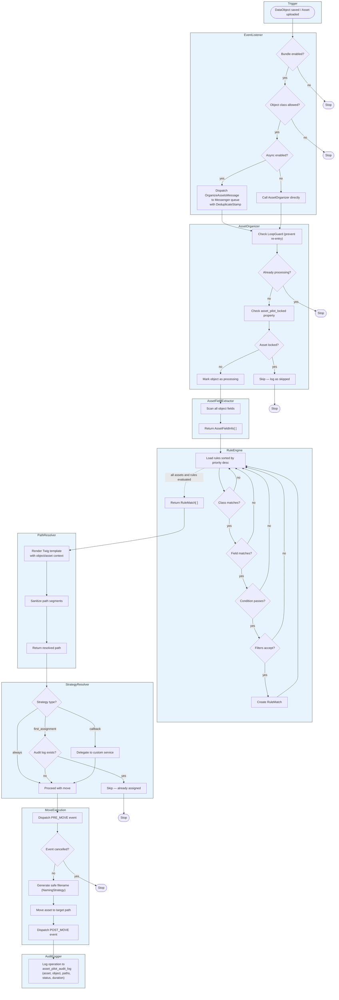

<p align="center">
  <a href="https://oronts.com">
    
  </a>
</p>

<h1 align="center">oronts/asset-pilot-bundle</h1>

<p align="center">
  <strong>Intelligent Rule-Based Asset Organization for Pimcore 12</strong>
</p>

<p align="center">
  <a href="#license"></a>
  <a href="https://www.pimcore.com/"></a>
  <a href="https://www.php.net/"></a>
  <a href="https://symfony.com/"></a>
</p>

<p align="center">
  <a href="#features">Features</a> &bull;
  <a href="#installation">Installation</a> &bull;
  <a href="#configuration">Configuration</a> &bull;
  <a href="#configuration-examples">Examples</a> &bull;
  <a href="#path-templates">Path Templates</a> &bull;
  <a href="#expression-language">Expression Language</a> &bull;
  <a href="#commands">Commands</a> &bull;
  <a href="#rest-api">REST API</a> &bull;
  <a href="#permissions">Permissions</a> &bull;
  <a href="#studio-ui">Studio UI</a> &bull;
  <a href="#extending">Extending</a> &bull;
  <a href="#testing">Testing</a>
</p>

---

<p align="center">
  
</p>

Asset Pilot automates the organization of Pimcore assets based on configurable rules. When a DataObject is saved, Asset Pilot evaluates its asset fields against a priority-ordered rule set, resolves target paths from Twig templates, and moves files into a structured folder hierarchy. It handles localized fields, supports async processing via Symfony Messenger, logs every operation to an audit trail, and ships with a full Studio UI dashboard.

---

## Features

**Rule Engine** — Priority-based rule matching with class filtering, field targeting, expression conditions, and asset filters (type, size, extension). Rules are evaluated top-down; all matching rules produce move operations.

**Twig Path Templates** — Target paths use full Twig syntax with pre-resolved context variables (`object`, `asset`, `locale`, `className`) and custom filters (`safe_key`, `pluck`, `first_of`, `slug`, `fallback`).

**Expression Language Conditions** — Rules support Symfony ExpressionLanguage conditions with 9 built-in functions: `asset_type()`, `asset_size()`, `asset_extension()`, `object_class()`, `is_image()`, `is_video()`, `is_document()`, `has_property()`, `path_matches()`.

**Move Strategies** — Three conflict resolution strategies: `always` (move on every save), `first_assignment` (move only when no prior audit log exists), `callback` (delegate to a custom service).

**Async Processing** — Asset moves dispatch to Symfony Messenger queues with transport-level deduplication via `DeduplicateStamp`. Bulk operations run in configurable batch sizes.

**Localized Field Support** — Automatically detects localized asset fields and includes the locale in path resolution, producing per-language folder structures.

**Audit Log** — Every move operation is logged to `asset_pilot_audit_log` with source/target paths, duration, status, trigger type, and timestamps. Supports CSV export, operation reversal, and per-rule asset history.

**Unused Asset Detection** — Finds assets not referenced by any DataObject or Document. Filter by type, extension, date range, folder, file size, and confidence level. Bulk delete or move.

**Confidence Scoring** — Unused assets are classified into five confidence levels: *definitely unused* (>90 days), *probably unused* (30-90 days), *recently uploaded* (<30 days), *historically used* (has audit history), and *protected* (locked). Color-coded badges in the UI help prioritize cleanup.

**Asset Protection** — Lock individual assets from organization via the `asset_pilot_locked` property. Configure folder-level exclusions to protect entire directory trees.

**Search by Related Object** — Find all assets referenced by a specific DataObject via the Pimcore dependencies table. Browse assets moved by a specific rule with optional date and class filters.

**Permissions Model** — Three granular permission levels: `asset_pilot_view` (read-only), `asset_pilot_operate` (lock/unlock, bulk actions, organize), `asset_pilot_admin` (revert operations). Registered natively in Pimcore via the installer.

**Idempotency Hardening** — Multi-layer duplicate protection: Redis-backed loop guard (prevents re-entry and async ping-pong), stale job detection (compares dispatch time vs. object modification), already-at-target skip, and Symfony Messenger `DeduplicateStamp` (prevents transport-level duplicates).

**Loop Prevention** — Cache-backed guard prevents infinite recursion when asset moves trigger DataObject saves. Includes a 5-minute cooldown for recently-moved assets and 10-second dispatch deduplication.

**Config Validation** — CLI command validates all rules: class existence, field names, condition syntax, Twig template compilation, callback service registration, filter values, and duplicate priority warnings.

**Rule Debugger** — Step-by-step rule evaluation trace per object/asset pair. Shows why each rule matched or was skipped (disabled, class mismatch, field mismatch, condition failed, filter rejected).

**Studio UI Integration** — Full React dashboard integrated into Pimcore Studio via Module Federation. Six tabs: Dashboard, Rules, Operations, Audit Log, Unused Assets, Asset Management.

---

## Architecture



> **Note:** Extracts assets from: image, video, document fields · gallery, hotspotimage fields · relation fields (many-to-one, many-to-many) · localized fields (all locales)

```
src/
├── Audit/                  AuditLogger — database-backed operation logging
├── Command/                CLI: organize, debug-rule, validate-config, status, audit, cleanup-unused
├── Condition/              ConditionEvaluatorInterface + ExpressionLanguage impl
├── Controller/Api/         REST API controllers (6 controllers, 25+ endpoints)
├── DependencyInjection/    Bundle configuration tree + service loading
├── Dto/                    API request/response DTOs
├── Engine/                 RuleEngine — core matching + explain logic
├── Enum/                   MoveStrategy, OperationStatus, TriggerType, AssetPilotPermission
├── Event/                  AssetMoveEvent + event constants
├── EventListener/          DataObject save + Asset upload listeners (with DeduplicateStamp)
├── Filter/                 AssetFilterInterface + type/size/extension/composite
├── Message/                Messenger messages: OrganizeAssets, BulkOrganize
├── MessageHandler/         Async handlers with stale job detection
├── Model/                  Rule, RuleMatch, RuleEvaluation, MoveOperation, OperationResult
├── Naming/                 NamingStrategyInterface + SafeNamingStrategy
├── PathResolver/           PathResolverInterface + Twig TemplatePathResolver
├── Service/                AssetOrganizer, AssetFieldExtractor, AssetSearchService,
│                           AssetPropertyService, UnusedAssetFinder, ConfidenceScorer,
│                           ConfigValidator, LoopGuard
├── Strategy/               ConflictStrategyInterface + Always/FirstAssignment/Callback
├── Webpack/                Module Federation entry point provider
├── Installer.php           Database schema + permission registration
└── OrontsAssetPilotBundle.php
```

---

## Installation

### 1. Require the package

```bash
composer require oronts/asset-pilot-bundle
```

### 2. Enable the bundle

Add to `config/bundles.php`:

```php
return [
    // ...
    Oronts\AssetPilotBundle\OrontsAssetPilotBundle::class => ['all' => true],
];
```

### 3. Install the database table and permissions

```bash
bin/console pimcore:bundle:install OrontsAssetPilotBundle
```

This creates:
- The `asset_pilot_audit_log` table with indexes on `asset_id`, `object_id`, `rule_name`, `status`, and `created_at`
- Three Pimcore permissions: `asset_pilot_view`, `asset_pilot_operate`, `asset_pilot_admin`

### 4. Configure Messenger transport

Add the transport and routing to `config/packages/messenger.yaml`:

```yaml
framework:
    messenger:
        transports:
            asset_pilot:
                dsn: '%messenger.dsn%/asset_pilot'
                retry_strategy:
                    max_retries: 3
                    delay: 2000
                    multiplier: 3
                    max_delay: 30000

        routing:
            'Oronts\AssetPilotBundle\Message\OrganizeAssetsMessage': asset_pilot
            'Oronts\AssetPilotBundle\Message\BulkOrganizeMessage': asset_pilot
```

### 5. Configure Symfony Lock (required for message deduplication)

```yaml
# config/packages/lock.yaml
framework:
    lock: 'redis://%env(REDIS_HOST)%'
```

Enabling `framework.lock` is what makes the async deduplication work: Symfony registers the
Messenger `DeduplicateMiddleware` on the default bus automatically once lock is enabled, and that
middleware is what gives the `DeduplicateStamp` (used by the save listeners) its effect. Without a
lock configured the stamp is inert and duplicate organize messages are not collapsed. This requires
`symfony/messenger` and `symfony/lock` `^7.3` (both are declared by the bundle).

### 6. Build the Studio UI assets

```bash
bin/console assets:install
bin/console cache:clear
```

---

## Configuration

Create `config/packages/oronts_asset_pilot.yaml`:

```yaml
oronts_asset_pilot:
    enabled: true

    rules:
        product_images:
            class: Product
            fields: [images, galleryImages]
            condition: 'object.getItemNumber() != null'
            target_path: '/Products/{{ object.getItemNumber() }}/Images'
            strategy: always
            priority: 100
            filters:
                types: [image]
                max_size: 52428800

        product_documents:
            class: Product
            fields: [datasheet, manual, brochure]
            target_path: '/Products/{{ object.getItemNumber() }}/Documents{{ locale ? "/" ~ locale : "" }}'
            strategy: always
            priority: 70

    strategies:
        default: always

    naming:
        collision_pattern: counter
        slugify: true

    async:
        enabled: true
        batch_size: 50

    audit:
        enabled: true
        retention_days: 90

    protection:
        exclude_folders:
            - /Protected/
            - /Manual/
        lock_property: asset_pilot_locked

    logging:
        channel: asset_pilot
```

### Configuration Reference

| Key | Type | Default | Description |
|-----|------|---------|-------------|
| `enabled` | `bool` | `true` | Global on/off switch |
| `rules` | `map` | `[]` | Named rule definitions (see below) |
| `strategies.default` | `enum` | `always` | Default strategy: `always`, `first_assignment`, `callback` |
| `naming.collision_pattern` | `enum` | `counter` | Filename collision resolution: `counter`, `timestamp`, `uuid` |
| `naming.slugify` | `bool` | `true` | Slugify filenames during organization |
| `async.enabled` | `bool` | `true` | Dispatch moves via Symfony Messenger |
| `async.batch_size` | `int` | `50` | Operations per batch message |
| `audit.enabled` | `bool` | `true` | Enable audit logging |
| `audit.retention_days` | `int` | `90` | Days to retain audit entries |
| `protection.exclude_folders` | `string[]` | `[]` | Folders excluded from organization (e.g., `["/Protected/"]`) |
| `protection.lock_property` | `string` | `asset_pilot_locked` | Custom property name used to lock assets |
| `logging.channel` | `string` | `asset_pilot` | Monolog channel name |

### Rule Options

| Key | Type | Required | Default | Description |
|-----|------|----------|---------|-------------|
| `class` | `string` | yes | — | DataObject class name or `*` for wildcard |
| `fields` | `string[]` | no | `[]` | Field names to match. Empty = all asset fields |
| `condition` | `string` | no | `null` | ExpressionLanguage condition |
| `target_path` | `string` | yes | — | Twig path template |
| `strategy` | `enum` | no | `always` | `always`, `first_assignment`, `callback` |
| `callback` | `string` | no | `null` | Service ID (required when strategy is `callback`) |
| `priority` | `int` | no | `10` | Higher values match first |
| `enabled` | `bool` | no | `true` | Enable/disable individual rules |
| `filters.types` | `string[]` | no | `[]` | Asset types: `image`, `video`, `document`, etc. |
| `filters.min_size` | `int` | no | `null` | Minimum file size in bytes |
| `filters.max_size` | `int` | no | `null` | Maximum file size in bytes |
| `filters.extensions` | `string[]` | no | `[]` | Allowed file extensions |

---

## Configuration Examples

### E-commerce: Product Assets by Item Number

Organize product images and documents into folders named by item number. Localized documents (datasheets, manuals) get a locale subfolder.

```yaml
oronts_asset_pilot:
    rules:
        product_images:
            class: Product
            fields: [images, galleryImages, thumbnails]
            condition: 'object.getItemNumber() != null'
            target_path: '/Products/{{ object.getItemNumber() }}/Images'
            strategy: always
            priority: 100
            filters:
                types: [image]
                extensions: [jpg, png, webp]
                max_size: 52428800

        product_documents:
            class: Product
            fields: [datasheet, manual, brochure]
            condition: 'object.getItemNumber() != null'
            target_path: '/Products/{{ object.getItemNumber() }}/Documents{{ locale ? "/" ~ locale : "" }}'
            strategy: always
            priority: 80

        product_videos:
            class: Product
            fields: [productVideo, tutorialVideo]
            target_path: '/Products/{{ object.getItemNumber() }}/Media'
            strategy: always
            priority: 60
            filters:
                types: [video]
```

Resulting folder structure:

```
/Products/
├── ART-10042/
│   ├── Images/
│   │   ├── product-front.jpg
│   │   └── product-back.png
│   ├── Documents/
│   │   ├── en/
│   │   │   └── datasheet-en.pdf
│   │   └── de/
│   │       └── datasheet-de.pdf
│   └── Media/
│       └── tutorial.mp4
└── ART-10043/
    └── ...
```

### Category-Based Hierarchy

Organize assets into folders derived from the object's category relation. Uses `first_of` to grab the category key, with a fallback for uncategorized products.

```yaml
oronts_asset_pilot:
    rules:
        category_images:
            class: Product
            fields: [images]
            target_path: >-
                /Catalog/{{ object.getCategories()|first_of("key", "Uncategorized") }}/{{ object.getItemNumber()|fallback("unknown") }}/Images
            strategy: always
            priority: 100
            filters:
                types: [image]

        category_documents:
            class: Product
            fields: [datasheet, certificate]
            target_path: >-
                /Catalog/{{ object.getCategories()|first_of("key", "Uncategorized") }}/{{ object.getItemNumber()|fallback("unknown") }}/Docs{{ locale ? "/" ~ locale : "" }}
            strategy: always
            priority: 80
```

Resulting folder structure:

```
/Catalog/
├── Electronics/
│   ├── ART-10042/
│   │   ├── Images/
│   │   └── Docs/
│   │       ├── en/
│   │       └── de/
│   └── ART-10043/
│       └── ...
├── Furniture/
│   └── ...
└── Uncategorized/
    └── ...
```

### Multi-Class Setup

Apply rules to different DataObject classes. Use the `*` wildcard to create a catch-all rule for any class that doesn't have a specific rule.

```yaml
oronts_asset_pilot:
    rules:
        product_assets:
            class: Product
            target_path: '/Products/{{ object.getItemNumber()|fallback(object.getKey()) }}/Assets'
            strategy: always
            priority: 100
            filters:
                types: [image, document]

        category_banners:
            class: Category
            fields: [bannerImage, icon]
            target_path: '/Categories/{{ object.getKey() }}'
            strategy: first_assignment
            priority: 90
            filters:
                types: [image]

        brand_logos:
            class: Brand
            fields: [logo, headerImage]
            target_path: '/Brands/{{ object.getName()|slug }}'
            strategy: first_assignment
            priority: 80

        catch_all:
            class: '*'
            target_path: '/Assets/{{ className }}/{{ object.getKey()|safe_key }}'
            strategy: always
            priority: 1
```

### First Assignment Strategy

Use `first_assignment` when assets should only be organized on first save. Once moved, they stay put even if the object is updated. Useful for QR codes, generated certificates, or any asset that should not be relocated after initial placement.

```yaml
oronts_asset_pilot:
    rules:
        generated_qrcode:
            class: Product
            fields: [qrCode]
            target_path: '/Products/{{ object.getItemNumber() }}/QR{{ locale ? "/" ~ locale : "" }}'
            strategy: first_assignment
            priority: 50
            filters:
                types: [image]

        certificates:
            class: Product
            fields: [certificate, testReport]
            target_path: '/Products/{{ object.getItemNumber() }}/Certificates'
            strategy: first_assignment
            priority: 40
            filters:
                types: [document]
                extensions: [pdf]
```

### Callback Strategy with Custom Logic

Delegate the move decision to a custom service. The service receives the asset, object, and rule, and returns `true` to proceed or `false` to skip.

```yaml
oronts_asset_pilot:
    rules:
        conditional_move:
            class: Product
            target_path: '/Products/{{ object.getItemNumber() }}/Images'
            strategy: callback
            callback: App\AssetPilot\Strategy\ApprovalStrategy
            priority: 100
```

```php
// src/AssetPilot/Strategy/ApprovalStrategy.php
class ApprovalStrategy implements ConflictStrategyInterface
{
    public function resolve(Asset $asset, AbstractObject $object, Rule $rule): bool
    {
        // Only move assets for published objects
        if ($object instanceof Concrete && !$object->isPublished()) {
            return false;
        }

        // Only move during business hours
        $hour = (int) date('H');
        return $hour >= 8 && $hour < 18;
    }

    public function supports(MoveStrategy $strategy): bool
    {
        // Reached via the callback strategy; return false so it is not selected directly.
        return false;
    }
}
```

Register the service as public so `CallbackStrategy` can resolve it by id:

```yaml
services:
    App\AssetPilot\Strategy\ApprovalStrategy:
        public: true
```

### Sync Mode (No Messenger Queue)

Disable async processing to move assets immediately during the save request. Suitable for development environments or small catalogs where move operations are fast.

```yaml
oronts_asset_pilot:
    async:
        enabled: false

    rules:
        product_images:
            class: Product
            target_path: '/Products/{{ object.getKey() }}/Images'
            strategy: always
            priority: 10
```

### Asset Protection

Lock specific folders from automation and configure the lock property name.

```yaml
oronts_asset_pilot:
    protection:
        exclude_folders:
            - /Protected/
            - /Manual/
            - /Brand-Assets/
        lock_property: asset_pilot_locked
```

Assets in excluded folders are never processed. Individual assets can be locked/unlocked via the API (`POST /assets/{id}/lock`, `DELETE /assets/{id}/lock`) or the Studio UI.

### Date-Based Organization

Organize uploads by year and month. Useful for editorial content, blog posts, or any time-based content.

```yaml
oronts_asset_pilot:
    rules:
        blog_images:
            class: BlogPost
            fields: [heroImage, contentImages]
            target_path: '/Blog/{{ date.format("Y") }}/{{ date.format("m") }}/{{ object.getKey()|slug }}'
            strategy: always
            priority: 100
            filters:
                types: [image]

        news_attachments:
            class: NewsArticle
            target_path: '/News/{{ date.format("Y/m/d") }}/{{ object.getKey()|slug }}'
            strategy: always
            priority: 90
```

### Restrictive Filters

Combine type, extension, and size filters to tightly control which assets a rule processes.

```yaml
oronts_asset_pilot:
    rules:
        high_res_photos:
            class: Product
            fields: [images]
            target_path: '/Products/{{ object.getItemNumber() }}/HighRes'
            strategy: always
            priority: 100
            filters:
                types: [image]
                extensions: [jpg, tiff, png]
                min_size: 1048576      # at least 1 MB
                max_size: 104857600    # max 100 MB

        small_thumbnails:
            class: Product
            fields: [thumbnail]
            target_path: '/Products/{{ object.getItemNumber() }}/Thumbs'
            strategy: always
            priority: 90
            filters:
                types: [image]
                extensions: [jpg, png, webp]
                max_size: 1048576      # under 1 MB
```

---

## Path Templates

Target paths use Twig syntax. The resolver provides these context variables:

| Variable | Type | Description |
|----------|------|-------------|
| `object` | `AbstractObject` | The DataObject being saved |
| `asset` | `Asset` | The asset being organized |
| `locale` | `?string` | Locale code for localized fields (`en`, `de`, etc.) or `null` |
| `date` | `DateTimeImmutable` | Current date/time |
| `className` | `string` | DataObject class name |

You can call any method on the `object` and `asset` variables directly in the template. The resolver handles null values gracefully and falls back to `'unknown'` for empty segments.

### Custom Filters

| Filter | Usage | Description |
|--------|-------|-------------|
| `safe_key` | `{{ value\|safe_key }}` | Replace non-alphanumeric chars with `-` |
| `pluck` | `{{ items\|pluck('key') }}` | Extract a property from each array item |
| `first_of` | `{{ items\|first_of('key') }}` | Get property from first item, fallback to `'unknown'` |
| `slug` | `{{ value\|slug }}` | URL-safe lowercase slug |
| `fallback` | `{{ value\|fallback('default') }}` | Return fallback when value is empty/null |
| `trim_path` | `{{ value\|trim_path }}` | Strip leading/trailing slashes |

### Custom Functions

| Function | Usage | Description |
|----------|-------|-------------|
| `coalesce` | `{{ coalesce(a, b, c) }}` | First non-null, non-empty value |
| `prop` | `{{ prop(obj, 'method', arg1) }}` | Safely call a method on an object |
| `rel` | `{{ rel(object, 'categories', 0) }}` | Safely access a relation by index |
| `has_relation` | `` | Check if relation has items |

### Path Template Examples

```yaml
# Simple flat structure
target_path: '/Products/{{ object.getItemNumber() }}/Images'

# Category hierarchy
target_path: '/Products/{{ object.getCategories()|first_of("key", "Uncategorized") }}/{{ object.getItemNumber() }}/Images'

# Locale-aware paths for localized fields
target_path: '/Products/{{ object.getItemNumber() }}/Documents{{ locale ? "/" ~ locale : "" }}'

# Date-based organization
target_path: '/Uploads/{{ date.format("Y/m") }}/{{ className }}'

# Conditional logic with Twig
target_path: '/Products/{{ object.getCategories()|first_of("key") }}/Products/Uncategorized/Assets'

# Joined relation path
target_path: '/Products/{{ object.getCategories()|pluck("key")|join("/") }}/Media'

# Coalesce multiple possible identifiers
target_path: '/Products/{{ coalesce(prop(object, "getItemNumber"), prop(object, "getSku"), object.getKey()) }}/Assets'

# Fallback with slug
target_path: '/{{ className }}/{{ object.getName()|slug|fallback("unnamed") }}'
```

---

## Expression Language

Rule conditions use Symfony ExpressionLanguage. Three variables are available: `object`, `asset`, and `rule`.

### Built-in Functions

| Function | Returns | Example |
|----------|---------|---------|
| `asset_type(asset)` | `string` | `asset_type(asset) == "image"` |
| `asset_size(asset)` | `int` | `asset_size(asset) > 1048576` |
| `asset_extension(asset)` | `string` | `asset_extension(asset) == "pdf"` |
| `object_class(object)` | `string` | `object_class(object) == "Product"` |
| `is_image(asset)` | `bool` | `is_image(asset)` |
| `is_video(asset)` | `bool` | `is_video(asset)` |
| `is_document(asset)` | `bool` | `is_document(asset)` |
| `has_property(element, name)` | `bool` | `has_property(asset, "source")` |
| `path_matches(asset, pattern)` | `bool` | `path_matches(asset, "#/temp/#")` |

### Condition Examples

```yaml
# Only objects that have an item number set
condition: 'object.getItemNumber() != null'

# Only images under 10 MB
condition: 'is_image(asset) and asset_size(asset) < 10485760'

# Only PDF files
condition: 'asset_extension(asset) == "pdf"'

# Compound: images over 1 MB from Product class
condition: 'is_image(asset) and asset_size(asset) > 1048576 and object_class(object) == "Product"'

# Skip assets already in the target structure
condition: 'not path_matches(asset, "#^/Products/#")'

# Only process assets with a specific property
condition: 'has_property(asset, "approved") and has_property(asset, "reviewed")'

# Match only videos or documents (no images)
condition: 'is_video(asset) or is_document(asset)'
```

---

## Commands

### Organize Assets

```bash
# Organize a single object
bin/console asset-pilot:organize --object-id=42

# Dry run (preview without moving)
bin/console asset-pilot:organize --object-id=42 --dry-run

# Bulk organize all objects of a class
bin/console asset-pilot:organize --class=Product

# Async bulk (dispatch to messenger queue)
bin/console asset-pilot:organize --class=Product --async --batch-size=100

# Verbose dry run — shows full rule evaluation per asset
bin/console asset-pilot:organize --object-id=42 --dry-run -v
```

### Validate Configuration

```bash
# Validate all configured rules
bin/console asset-pilot:validate-config
```

Checks performed:
- Class exists in Pimcore (`ClassDefinition::getByName()`)
- Fields exist in the class definition (including localized fields)
- ExpressionLanguage condition syntax is valid
- Twig path template syntax is valid
- Callback service exists in the DI container (when strategy=callback)
- Filter type/extension values are valid
- Warns on duplicate priorities for the same class

### Debug Rules

```bash
# Debug rule evaluation for a specific object (shows all rules and why they matched/skipped)
bin/console asset-pilot:debug-rule --object-id=42

# Debug a specific asset against all rules
bin/console asset-pilot:debug-rule --object-id=42 --asset-id=100

# Filter to a single rule
bin/console asset-pilot:debug-rule --object-id=42 --rule=product_images

# Filter to a specific field
bin/console asset-pilot:debug-rule --object-id=42 --field=productImages
```

Output shows a table per rule with: rule name, result (MATCHED/SKIPPED), rejection reason (disabled, class_mismatch, field_mismatch, condition_failed, filter_rejected), condition expression and result, resolved target path, and priority.

### View Status

```bash
# Show configured rules and statistics
bin/console asset-pilot:status

# JSON output for scripting
bin/console asset-pilot:status --format=json
```

### Audit Log

```bash
# Recent operations
bin/console asset-pilot:audit --limit=50

# Filter by class and status
bin/console asset-pilot:audit --class=Product --status=completed --since="1 week ago"

# Filter by rule
bin/console asset-pilot:audit --rule=product_images

# Clean up old entries (respects retention_days config)
bin/console asset-pilot:audit --cleanup
```

### Clean Up Unused Assets

```bash
# Preview unused assets
bin/console asset-pilot:cleanup-unused --dry-run

# Delete unused images older than 90 days
bin/console asset-pilot:cleanup-unused --type=image --before="-90 days" --action=delete

# Move unused assets to archive folder
bin/console asset-pilot:cleanup-unused --action=move --move-to="/Archive/Unused"

# Filter by extension and folder
bin/console asset-pilot:cleanup-unused --extension=jpg,png --folder=/uploads/temp --dry-run
```

> Note: the unused-asset cleanup cannot filter by file size. The Pimcore `assets` table has no
> size column, and post-filtering after pagination would corrupt the count on a delete path, so
> `minSize`/`maxSize` are rejected rather than silently ignored. Rule-level `filters.min_size` /
> `filters.max_size` (see the rule reference) still work, because the asset is in memory during
> organization.

### Scheduled Jobs (Cron)

All commands can be automated via cron. Example crontab entries:

```bash
# --- Nightly ---
# Organize all Product assets (async, processed by messenger workers)
0 2 * * * cd /var/www/html && bin/console asset-pilot:organize --class=Product --async --batch-size=100 >> /var/log/asset-pilot.log 2>&1

# --- Weekly ---
# Generate unused asset report (dry-run, no changes)
0 3 * * 0 cd /var/www/html && bin/console asset-pilot:cleanup-unused --dry-run --type=image 2>&1 | mail -s "Unused Assets Report" admin@example.com

# Archive unused images older than 90 days
0 4 * * 0 cd /var/www/html && bin/console asset-pilot:cleanup-unused --type=image --before="-90 days" --action=move --move-to="/Archive/Unused" >> /var/log/asset-pilot.log 2>&1

# --- Monthly ---
# Clean up old audit log entries
0 5 1 * * cd /var/www/html && bin/console asset-pilot:audit --cleanup >> /var/log/asset-pilot.log 2>&1

# --- CI/CD ---
# Validate config after deployments
# bin/console asset-pilot:validate-config
# bin/console asset-pilot:debug-rule --object-id=42
```

For Kubernetes/Docker environments, use CronJob resources or container-level cron scheduling.

---

## Permissions

Asset Pilot registers three permissions in Pimcore's native permission system during installation. Assign them to user roles via **Settings > Users / Roles > Permissions**.

| Permission | Key | Description |
|------------|-----|-------------|
| **View** | `asset_pilot_view` | View dashboard, rules, audit log, unused assets, search assets. All read-only endpoints. |
| **Operate** | `asset_pilot_operate` | Organize assets, lock/unlock, bulk tag, bulk set properties, delete/move unused assets. |
| **Admin** | `asset_pilot_admin` | Revert completed operations from the audit log. |

All API endpoints enforce permissions via `#[IsGranted(AssetPilotPermission::*)]` attributes. The Studio UI hides action buttons when the user lacks the required permission.

The `GET /permissions` endpoint returns the current user's permission set:

```json
{
    "view": true,
    "operate": true,
    "admin": false
}
```

---

## REST API

All endpoints are prefixed with `/pimcore-studio/api/asset-pilot`. Requires Pimcore Studio authentication. Permissions are enforced on every endpoint (see [Permissions](#permissions)).

### Dashboard

| Method | Endpoint | Permission | Description |
|--------|----------|------------|-------------|
| `GET` | `/dashboard` | View | Dashboard statistics |
| `GET` | `/dashboard/class-stats` | View | Per-class breakdown |
| `GET` | `/permissions` | — | Current user's permission set |

### Operations

| Method | Endpoint | Permission | Description |
|--------|----------|------------|-------------|
| `POST` | `/organize` | Operate | Organize a single object |
| `POST` | `/organize/preview` | View | Dry-run preview |
| `POST` | `/organize/explain` | View | Detailed rule evaluation per asset |
| `POST` | `/organize/bulk` | Operate | Bulk organize by class or IDs |
| `POST` | `/operations/bulk-preview` | View | Paginated bulk preview |
| `GET` | `/operations/status` | View | Operation statistics |

#### Organize request body

```json
{
    "objectId": 42,
    "dryRun": false,
    "async": true
}
```

#### Bulk organize request body

```json
{
    "className": "Product",
    "async": true,
    "batchSize": 50
}
```

Or with explicit IDs:

```json
{
    "objectIds": [1, 2, 3, 4, 5],
    "async": true,
    "batchSize": 50
}
```

#### Explain response

```json
{
    "objectId": 42,
    "operations": [{
        "assetId": 456,
        "sourcePath": "/uploads/photo.jpg",
        "targetPath": "/Products/ART-123/Images/photo.jpg",
        "ruleName": "product_images",
        "status": "completed"
    }],
    "evaluations": [{
        "assetId": 456,
        "assetPath": "/uploads/photo.jpg",
        "fieldName": "images",
        "locale": null,
        "ruleName": "product_images",
        "matched": true,
        "rejectionReason": null,
        "conditionExpression": "object.getItemNumber() != null",
        "conditionResult": true,
        "conditionError": null,
        "filterDetails": null,
        "resolvedPath": "/Products/ART-123/Images",
        "priority": 100,
        "enabled": true
    }, {
        "assetId": 456,
        "assetPath": "/uploads/photo.jpg",
        "fieldName": "images",
        "locale": null,
        "ruleName": "product_documents",
        "matched": false,
        "rejectionReason": "filter_rejected",
        "conditionExpression": null,
        "conditionResult": true,
        "conditionError": null,
        "filterDetails": "type mismatch: image not in [document]",
        "resolvedPath": null,
        "priority": 70,
        "enabled": true
    }]
}
```

### Rules

| Method | Endpoint | Permission | Description |
|--------|----------|------------|-------------|
| `GET` | `/rules` | View | List all configured rules |
| `GET` | `/rules/{name}` | View | Rule details with statistics |
| `GET` | `/rules/{name}/preview?objectId=42` | View | Preview rule against an object |

### Asset Management

| Method | Endpoint | Permission | Description |
|--------|----------|------------|-------------|
| `GET` | `/assets/search` | View | Search assets (params: `q`, `type`, `folder`, `objectId`, `page`, `limit`, `sort`, `order`) |
| `GET` | `/assets/by-object/{objectId}` | View | Assets linked to a DataObject via dependencies (params: `page`, `limit`, `type`) |
| `GET` | `/assets/tags` | View | List all available Pimcore tags |
| `GET` | `/assets/{id}/tags` | View | Get tags for a specific asset |
| `POST` | `/assets/{id}/lock` | Operate | Lock asset from organization |
| `DELETE` | `/assets/{id}/lock` | Operate | Unlock asset |
| `POST` | `/assets/bulk-tag` | Operate | Bulk assign tags to assets |
| `POST` | `/assets/bulk-property` | Operate | Bulk set custom properties |

#### Search parameters

| Parameter | Type | Description |
|-----------|------|-------------|
| `q` | `string` | Search by filename or path (LIKE match) |
| `type` | `string` | Filter by asset type: `image`, `document`, `video`, `audio`, `text`, `archive` |
| `folder` | `string` | Filter by folder path (e.g., `/Products/`) |
| `objectId` | `int` | Filter to assets referenced by a specific DataObject (via dependencies table) |
| `page` | `int` | Page number (default: 1) |
| `limit` | `int` | Items per page (default: 50, max: 200) |
| `sort` | `string` | Sort field: `id`, `filename`, `type`, `file_size`, `modified_at` |
| `order` | `string` | Sort order: `asc` or `desc` |

#### Bulk tag request body

```json
{
    "assetIds": [1, 2, 3],
    "tagIds": [10, 20],
    "replace": false
}
```

Set `replace: true` to remove all existing tags before assigning new ones.

#### Bulk property request body

```json
{
    "assetIds": [1, 2, 3],
    "name": "department",
    "type": "text",
    "data": "Marketing"
}
```

Supported types: `text`, `bool`, `select`.

### Unused Assets

| Method | Endpoint | Permission | Description |
|--------|----------|------------|-------------|
| `GET` | `/unused-assets` | View | List unused assets with confidence scoring |
| `GET` | `/unused-assets/stats` | View | Unused asset statistics by type |
| `POST` | `/unused-assets/bulk-delete` | Operate | Delete unused assets |
| `POST` | `/unused-assets/bulk-move` | Operate | Move unused assets to folder |

#### Unused assets parameters

| Parameter | Type | Description |
|-----------|------|-------------|
| `type` | `string` | Filter by asset type |
| `extension` | `string` | Comma-separated extensions (e.g., `pdf,png,jpg`) |
| `before` | `string` | Modified before date (ISO format) |
| `after` | `string` | Modified after date (ISO format) |
| `folder` | `string` | Filter by folder path |
| `confidence` | `string` | Filter by confidence: `definitely_unused`, `probably_unused`, `recently_uploaded`, `historically_used`, `protected` |
| `page` | `int` | Page number (default: 1) |
| `limit` | `int` | Items per page (default: 50, max: 200) |
| `sort` | `string` | Sort field |
| `order` | `string` | Sort order: `asc` or `desc` |

#### Confidence levels

| Level | Criteria | Recommended Action |
|-------|----------|--------------------|
| `definitely_unused` | No references, last modified >90 days ago | Safe to delete |
| `probably_unused` | No references, last modified 30-90 days ago | Review before deleting |
| `recently_uploaded` | No references, last modified <30 days ago | Wait — may be in use soon |
| `historically_used` | No references, but has audit history of past moves | Investigate before deleting |
| `protected` | Has `asset_pilot_locked` property | Excluded from cleanup |

### Audit Log

| Method | Endpoint | Permission | Description |
|--------|----------|------------|-------------|
| `GET` | `/audit` | View | Paginated audit entries (params: `page`, `limit`, `class`, `status`, `ruleName`, `sort`, `order`) |
| `GET` | `/audit/stats` | View | Audit statistics |
| `GET` | `/audit/export` | View | Export as CSV (params: `class`, `status`, `ruleName`) |
| `GET` | `/audit/by-rule/{ruleName}/assets` | View | Distinct assets moved by a rule (params: `page`, `limit`, `since`, `class`) |
| `POST` | `/audit/{id}/revert` | Admin | Revert a completed operation |

#### Assets by rule parameters

| Parameter | Type | Description |
|-----------|------|-------------|
| `since` | `string` | Only include moves after this date (ISO format, e.g., `2026-02-01`) |
| `class` | `string` | Filter by object class name |
| `page` | `int` | Page number (default: 1) |
| `limit` | `int` | Items per page (default: 50) |

---

## Studio UI

Asset Pilot integrates into Pimcore Studio as a Module Federation remote. The UI provides six tabs:

| Tab | Description |
|-----|-------------|
| **Dashboard** | Statistics overview (organized, pending, failed, skipped counts), class breakdown table, recent operations list |
| **Rules** | View all configured rules with priority, strategy, target path. Detail modal with configuration and statistics. Preview modal to test a rule against a specific object ID. |
| **Operations** | Single object organize (with dry-run, async, and explain modes). Bulk organize by class with paginated preview and "Organize All" button. System status with refresh. |
| **Audit Log** | Full operation history with sorting. Filter by class, status, and rule name. CSV export. Revert individual operations. |
| **Unused Assets** | Confidence-scored unused asset list with color-coded badges. Filter by type, extensions, date range, folder, size, and confidence level. Bulk delete or move selected assets. Filter presets. |
| **Asset Management** | Search assets by filename/path, filter by type, folder, or Object ID. Lock/unlock assets. Bulk assign tags. Bulk set custom properties. Sortable columns with pagination. |

### Confidence Badges

Unused assets display color-coded confidence badges:

| Badge | Color | Meaning |
|-------|-------|---------|
| Definitely Unused | Green | Safe to clean up (>90 days, no references) |
| Probably Unused | Yellow | Review recommended (30-90 days) |
| Recently Uploaded | Red | Wait before action (<30 days) |
| Historically Used | Orange | Was previously organized — investigate |
| Protected | Gray | Locked asset, excluded from cleanup |

### Localization

The Studio UI ships with English and German translations. All UI strings use the `asset-pilot.*` i18n namespace.

---

## Idempotency & Loop Prevention

Asset Pilot uses a multi-layer approach to prevent duplicate processing:

| Layer | Mechanism | TTL | Purpose |
|-------|-----------|-----|---------|
| **Loop Guard** | Redis cache (`cache.app`) | 60s | Prevents re-entry when asset moves trigger DataObject saves |
| **Recently Moved** | Redis cache | 300s (5 min) | Prevents async ping-pong for shared assets between objects |
| **Dispatch Dedup** | Redis cache | 10s | Prevents burst duplicate dispatches from rapid saves |
| **Stale Job Detection** | `dispatchedAt` timestamp | — | Skips processing if object was modified after message dispatch |
| **Already-at-Target** | Path comparison | — | Skips move when source path equals target path |
| **DeduplicateStamp** | Symfony Lock (Redis) | 30s/60s | Transport-level deduplication prevents the same message from being processed twice |

The `DeduplicateStamp` TTLs:
- **30 seconds** for single-object organize messages (`asset_pilot_organize_{objectId}`)
- **60 seconds** for bulk organize messages (`asset_pilot_bulk_{batchHash}`)

---

## Extending

Asset Pilot is built around interfaces. Swap out any component by implementing the interface and registering it as a service.

### Custom Filter

Restrict which assets a rule applies to. All registered filters run inside `CompositeFilter` using AND logic — the first rejection short-circuits evaluation.

```php
namespace App\AssetPilot\Filter;

use Oronts\AssetPilotBundle\Filter\AssetFilterInterface;
use Oronts\AssetPilotBundle\Model\Rule;
use Pimcore\Model\Asset;
use Pimcore\Model\DataObject\AbstractObject;

class PublishedOnlyFilter implements AssetFilterInterface
{
    public function accept(Asset $asset, AbstractObject $object, Rule $rule): bool
    {
        if ($object instanceof \Pimcore\Model\DataObject\Concrete) {
            return $object->isPublished();
        }
        return true;
    }
}
```

```yaml
services:
    App\AssetPilot\Filter\PublishedOnlyFilter:
        tags:
            - { name: 'oronts_asset_pilot.filter' }
```

### Custom Strategy

Control when assets should be moved. Implement `ConflictStrategyInterface` and reference your service
through the built-in `callback` strategy: the rule sets `strategy: callback` and `callback: <your service id>`,
and `CallbackStrategy` delegates the decision to your `resolve()`.

```php
namespace App\AssetPilot\Strategy;

use Oronts\AssetPilotBundle\Enum\MoveStrategy;
use Oronts\AssetPilotBundle\Model\Rule;
use Oronts\AssetPilotBundle\Strategy\ConflictStrategyInterface;
use Pimcore\Model\Asset;
use Pimcore\Model\DataObject\AbstractObject;

class BusinessHoursStrategy implements ConflictStrategyInterface
{
    public function resolve(Asset $asset, AbstractObject $object, Rule $rule): bool
    {
        $hour = (int) date('H');
        return $hour >= 9 && $hour < 17;
    }

    public function supports(MoveStrategy $strategy): bool
    {
        // Reached via the callback strategy, not by direct resolver selection. Returning a built-in
        // value here would collide with the bundle's own CallbackStrategy, so return false.
        return false;
    }
}
```

```yaml
services:
    App\AssetPilot\Strategy\BusinessHoursStrategy:
        public: true   # CallbackStrategy resolves it from the container by service id
```

Reference it in a rule config:

```yaml
oronts_asset_pilot:
    rules:
        controlled_move:
            class: Product
            target_path: '/Products/{{ object.getItemNumber() }}/Images'
            strategy: callback
            callback: App\AssetPilot\Strategy\BusinessHoursStrategy
```

> The three built-in strategy names (`always`, `first_assignment`, `callback`) are the only values
> accepted by the rule `strategy` option. Custom logic plugs in through `callback`, as above; there
> is no separate custom strategy name to register.

### Add Twig Filters/Functions to Path Templates

To add filters or functions usable in `target_path` templates without replacing the resolver, tag a
Twig extension with `oronts_asset_pilot.twig_extension`:

```php
class AssetPilotTwigExtension extends \Twig\Extension\AbstractExtension
{
    public function getFilters(): array
    {
        return [new \Twig\TwigFilter('region_code', fn (string $v): string => substr($v, 0, 2))];
    }
}
```

```yaml
services:
    App\AssetPilot\Twig\AssetPilotTwigExtension:
        tags: ['oronts_asset_pilot.twig_extension']
```

Now `target_path: '/Regions/{{ object.getCountry()|region_code }}'` works.

### Add Functions to Rule Conditions

To add functions usable in rule `condition` expressions, tag a Symfony
`ExpressionFunctionProviderInterface` with `oronts_asset_pilot.expression_function_provider`:

```php
use Symfony\Component\ExpressionLanguage\ExpressionFunction;
use Symfony\Component\ExpressionLanguage\ExpressionFunctionProviderInterface;

class AssetPilotExpressionProvider implements ExpressionFunctionProviderInterface
{
    public function getFunctions(): array
    {
        return [
            new ExpressionFunction(
                'in_business_hours',
                static fn (): string => '((int) date("H") >= 9 && (int) date("H") < 17)', // compiler
                static fn (array $vars): bool => (int) date('H') >= 9 && (int) date('H') < 17, // evaluator
            ),
        ];
    }
}
```

```yaml
services:
    App\AssetPilot\Expression\AssetPilotExpressionProvider:
        tags: ['oronts_asset_pilot.expression_function_provider']
```

Now `condition: 'in_business_hours() and is_image(asset)'` works.

> Use names that do not clash with the built-ins. The bundle's own Twig filters/functions
> (`safe_key`, `pluck`, `coalesce`, ...) and condition functions (`is_image`, `asset_type`, ...) are
> registered first; reuse a built-in name and a consumer expression function will override it, while a
> Twig filter of the same name is shadowed by the built-in.

### Custom Path Resolver

Replace the Twig-based path resolution entirely. Implement `PathResolverInterface` and override the service alias.

```php
namespace App\AssetPilot\PathResolver;

use Oronts\AssetPilotBundle\Model\Rule;
use Oronts\AssetPilotBundle\PathResolver\PathResolverInterface;
use Pimcore\Model\Asset;
use Pimcore\Model\DataObject\AbstractObject;

class DatabasePathResolver implements PathResolverInterface
{
    public function __construct(private readonly \Doctrine\DBAL\Connection $db) {}

    public function resolve(
        AbstractObject $object,
        Asset $asset,
        Rule $rule,
        ?string $locale = null,
    ): string {
        $path = $this->db->fetchOne(
            'SELECT target_path FROM asset_path_mappings WHERE class_name = ? AND rule_name = ?',
            [$object->getClassName(), $rule->name]
        );
        return $path ?: '/Fallback/' . $object->getKey();
    }
}
```

```yaml
services:
    Oronts\AssetPilotBundle\PathResolver\PathResolverInterface:
        alias: App\AssetPilot\PathResolver\DatabasePathResolver
```

### Custom Condition Evaluator

Replace the ExpressionLanguage evaluator with your own logic. Implement `ConditionEvaluatorInterface` and override the service alias.

```php
namespace App\AssetPilot\Condition;

use Oronts\AssetPilotBundle\Condition\ConditionEvaluatorInterface;
use Oronts\AssetPilotBundle\Model\Rule;
use Pimcore\Model\Asset;
use Pimcore\Model\DataObject\AbstractObject;

class WorkflowConditionEvaluator implements ConditionEvaluatorInterface
{
    public function evaluate(AbstractObject $object, Asset $asset, Rule $rule): bool
    {
        if ($rule->condition === null) {
            return true;
        }

        // Only proceed if the object's workflow state matches the condition
        return $object->getProperty('workflow_state') === $rule->condition;
    }
}
```

```yaml
services:
    Oronts\AssetPilotBundle\Condition\ConditionEvaluatorInterface:
        alias: App\AssetPilot\Condition\WorkflowConditionEvaluator
```

### Custom Naming Strategy

Control how filenames are generated and collisions are resolved. Implement `NamingStrategyInterface` and override the service alias.

```php
namespace App\AssetPilot\Naming;

use Oronts\AssetPilotBundle\Naming\NamingStrategyInterface;
use Pimcore\Model\Asset;

class HashNamingStrategy implements NamingStrategyInterface
{
    public function generateName(Asset $asset, string $targetPath): string
    {
        $ext = pathinfo($asset->getFilename(), PATHINFO_EXTENSION);
        $hash = substr(md5($asset->getFilename() . time()), 0, 8);
        return $hash . '.' . $ext;
    }
}
```

```yaml
services:
    Oronts\AssetPilotBundle\Naming\NamingStrategyInterface:
        alias: App\AssetPilot\Naming\HashNamingStrategy
```

### Events

Subscribe to asset move events for custom logic:

```php
namespace App\EventListener;

use Oronts\AssetPilotBundle\Event\AssetMoveEvent;
use Oronts\AssetPilotBundle\Event\AssetPilotEvents;
use Symfony\Component\EventDispatcher\Attribute\AsEventListener;

#[AsEventListener(event: AssetPilotEvents::PRE_MOVE)]
class AssetMoveListener
{
    public function __invoke(AssetMoveEvent $event): void
    {
        // Cancel moves to restricted paths
        if (str_starts_with($event->targetPath, '/Protected/')) {
            $event->cancel();
            return;
        }

        // Access event data: $event->asset, $event->object, $event->rule, $event->triggerType.
        // On POST_MOVE/MOVE_FAILED, $event->operation holds the MoveOperation and, on failure,
        // $event->throwable holds the cause. $event->isDryRun() is true during a preview.
    }
}
```

Move events (`AssetMoveEvent`):

| Event | Constant | Description |
|-------|----------|-------------|
| `oronts_asset_pilot.pre_move` | `AssetPilotEvents::PRE_MOVE` | Before move, cancellable (also fired in dry-run; `isDryRun()` is true) |
| `oronts_asset_pilot.post_move` | `AssetPilotEvents::POST_MOVE` | After a successful move; carries the `MoveOperation` |
| `oronts_asset_pilot.move_failed` | `AssetPilotEvents::MOVE_FAILED` | After a failed move; carries the `MoveOperation` and `throwable` |

Bulk events (`BulkOrganizeEvent`, carrying `objectIds`/`triggerType`/`results`):

| Event | Constant | Description |
|-------|----------|-------------|
| `oronts_asset_pilot.bulk_started` | `AssetPilotEvents::BULK_STARTED` | Before a bulk organize run |
| `oronts_asset_pilot.bulk_completed` | `AssetPilotEvents::BULK_COMPLETED` | After a bulk organize run; `results` populated |

Mutation events (`AssetMutationEvent`, carrying `assetIds`/`mutation`/`context`) — for hooking every
asset change outside the move pipeline (CDN purge, search reindex, DAM sync):

| Event | Constant | Description |
|-------|----------|-------------|
| `oronts_asset_pilot.asset_locked` | `AssetPilotEvents::ASSET_LOCKED` | An asset was locked |
| `oronts_asset_pilot.asset_unlocked` | `AssetPilotEvents::ASSET_UNLOCKED` | An asset was unlocked |
| `oronts_asset_pilot.asset_property_set` | `AssetPilotEvents::ASSET_PROPERTY_SET` | A property was bulk-set |
| `oronts_asset_pilot.assets_tagged` | `AssetPilotEvents::ASSETS_TAGGED` | Assets were bulk-tagged |
| `oronts_asset_pilot.unused_deleted` | `AssetPilotEvents::UNUSED_DELETED` | Unused assets were deleted |
| `oronts_asset_pilot.unused_moved` | `AssetPilotEvents::UNUSED_MOVED` | Unused assets were moved |
| `oronts_asset_pilot.reverted` | `AssetPilotEvents::REVERTED` | A move was reverted |

---

## Database Schema

The installer creates a single table:

```sql
CREATE TABLE asset_pilot_audit_log (
    id          INT AUTO_INCREMENT PRIMARY KEY,
    asset_id    INT          NOT NULL,
    asset_path_from VARCHAR(500) NOT NULL,
    asset_path_to   VARCHAR(500) NOT NULL,
    object_id   INT          NOT NULL,
    object_class VARCHAR(255) NOT NULL,
    rule_name   VARCHAR(255) NOT NULL,
    trigger_type VARCHAR(50) NOT NULL,
    status      VARCHAR(50)  NOT NULL,
    error_message TEXT        NULL,
    duration_ms INT          NULL,
    user_id     INT          NULL,
    created_at  DATETIME     NOT NULL,

    INDEX idx_audit_asset_id   (asset_id),
    INDEX idx_audit_object_id  (object_id),
    INDEX idx_audit_rule_name  (rule_name),
    INDEX idx_audit_status     (status),
    INDEX idx_audit_created_at (created_at)
);
```

---

## Testing

The bundle ships with 133 PHPUnit tests covering all core components.

```bash
cd bundles/asset-pilot-bundle
composer install
vendor/bin/phpunit
```

```
tests/
├── Unit/
│   ├── Condition/      ExpressionConditionEvaluator (15 tests)
│   ├── Engine/         RuleEngine (15 tests)
│   ├── Enum/           MoveStrategy, OperationStatus, TriggerType (5 tests)
│   ├── Event/          AssetMoveEvent, AssetPilotEvents (5 tests)
│   ├── EventListener/  DataObjectSaveListener (10 tests)
│   ├── Filter/         Type, Size, Extension, Composite filters (21 tests)
│   ├── Message/        OrganizeAssetsMessage, BulkOrganizeMessage (5 tests)
│   ├── MessageHandler/ BulkOrganizeHandler (4 tests)
│   ├── Model/          Rule, RuleMatch, MoveOperation, OperationResult, AssetFieldInfo (19 tests)
│   ├── Service/        LoopGuard (11 tests)
│   └── Strategy/       Always, FirstAssignment, Callback, Resolver (23 tests)
└── bootstrap.php
```

---

## Requirements

| Dependency | Version |
|------------|---------|
| PHP | >= 8.4 |
| Pimcore | ^12.0 |
| Symfony Expression Language | ^7.0 |
| Symfony Messenger | ^7.0 |
| Symfony Lock | ^7.0 |

---

## License

This project is licensed under the [GNU Affero General Public License v3.0](LICENSE) (AGPL-3.0), the same license used by Pimcore itself.

You are free to use, modify, and distribute this bundle in both private and commercial projects. If you modify the source code and distribute it or run it as a service, you must make your modifications available under the same license.

---

## Consulting & Custom Development

<p align="center">
  <a href="https://oronts.com">
    
  </a>
</p>

**Oronts** provides custom development and integration services:

- Pimcore bundle development and customization
- PIM/DAM implementation and architecture
- Asset workflow automation
- E-commerce platform implementation

**Contact:** office@oronts.com | [oronts.com](https://oronts.com)

---

**Author:** [Oronts](https://oronts.com) - AI-powered automation, e-commerce platforms, cloud infrastructure.

**Contributors:** Refaat Al Ktifan (Refaat@alktifan.com)
