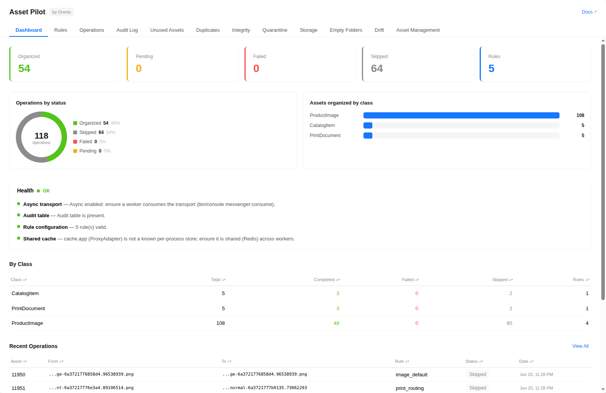

<p align="center">
  <a href="https://oronts.com">
    
  </a>
</p>

<p align="center">
  <strong><code>oronts/asset-pilot-bundle</code> — intelligent rule-based asset organization for Pimcore 12</strong>
</p>

<p align="center">
  <a href="#license"></a>
  <a href="https://www.pimcore.com/"></a>
  <a href="https://www.php.net/"></a>
  <a href="https://symfony.com/"></a>
</p>

<p align="center">
  <a href="#quick-start">Quick start</a> &bull;
  <a href="#example">Example</a> &bull;
  <a href="#documentation">Documentation</a> &bull;
  <a href="docs/index.md">Full docs</a>
</p>

---

<p align="center">
  
</p>

Asset Pilot automates how Pimcore assets are filed. When a DataObject is saved, it evaluates the
object's asset fields against a priority-ordered rule set, resolves a target path from a Twig template,
and moves the files into a structured folder hierarchy, handling localized fields, async processing,
a full audit trail, and a Studio UI dashboard.

## Features

- **Rule engine** — priority-ordered rules with class and field targeting, ExpressionLanguage
  conditions, and type/size/extension filters.
- **Twig target paths** — full Twig templates with custom filters and functions, and per-locale paths
  for localized fields.
- **Safe under async** — Symfony Messenger + Lock, a loop guard, transport deduplication, and an
  already-at-target skip keep the move pipeline idempotent.
- **Audit & revert** — every move is logged with source, target, duration, and trigger; CSV export and
  a loop-guarded revert are built in.
- **Unused-asset cleanup** — confidence-scored detection with bulk delete or archive, and per-asset or
  per-folder protection.
- **Studio UI** — a tabbed React dashboard (Dashboard, Rules, Operations, Audit, Unused, Duplicates,
  Integrity, Quarantine, Storage, Empty Folders, Drift, Asset Management) mounted in Pimcore Studio
  via Module Federation.
- **Built to extend** — an interface behind every seam (a service tag or a replaceable alias), plus a
  typed event on every mutation. See [Extending](docs/extending.md) and [Overriding](docs/overriding.md).

## Quick Start

```bash
composer require oronts/asset-pilot-bundle
```

Enable the bundle in `config/bundles.php`:

```php
return [
    // ...
    Oronts\AssetPilotBundle\OrontsAssetPilotBundle::class => ['all' => true],
];
```

Install the database table and permissions, then build the Studio UI:

```bash
bin/console pimcore:bundle:install OrontsAssetPilotBundle

# Studio UI ships as source (Module Federation remote), not prebuilt
npm --prefix assets/studio ci
npm --prefix assets/studio run build

bin/console assets:install
bin/console cache:clear
```

Full setup, including the required Messenger and Lock configuration for async deduplication, is in
[docs/installation.md](docs/installation.md).

## Example

Organize product images into a folder named by item number:

```yaml
oronts_asset_pilot:
    rules:
        product_images:
            class: Product
            fields: [images, galleryImages]
            condition: 'object.getItemNumber() != null'
            target_path: '/Products/{{ object.getItemNumber() }}/Images'
            strategy: always
            priority: 100
            filters:
                types: [image]
                extensions: [jpg, png, webp]
```

Preview the moves, then run them:

```bash
bin/console asset-pilot:organize --class=Product --dry-run
bin/console asset-pilot:organize --class=Product --async --batch-size=100
```

More recipes (category hierarchies, multi-class setups, move strategies, asset protection, date-based
organization) are in [docs/scenarios.md](docs/scenarios.md).

## Documentation

Everything lives in **[docs/](docs/index.md)**.

- **Getting started** — [Installation](docs/installation.md) &middot; [Usage](docs/usage.md) &middot; [Configuration](docs/configuration.md) &middot; [Scenarios](docs/scenarios.md)
- **Reference** — [Reference](docs/reference.md) &middot; [Commands](docs/commands.md) &middot; [REST API](docs/rest-api.md) &middot; [Path Templates](docs/path-templates.md) &middot; [Conditions](docs/conditions.md) &middot; [Permissions](docs/permissions.md) &middot; [Studio UI](docs/studio-ui.md) &middot; [Architecture](docs/architecture.md)
- **Extending & overriding** — [Developer Experience](docs/dx.md) &middot; [Extending](docs/extending.md) &middot; [Overriding](docs/overriding.md) &middot; [Testing](docs/testing.md)

## Requirements

| Dependency | Version |
|------------|---------|
| PHP | >= 8.4 |
| Pimcore | ^12.0 |
| Symfony Expression Language | ^7.0 |
| Symfony Messenger | ^7.3 |
| Symfony Lock | ^7.3 |

## License

Licensed under the [GNU Affero General Public License v3.0](LICENSE) (AGPL-3.0), the same license as
Pimcore. Use, modify, and distribute it in private and commercial projects; if you distribute a
modified version or run it as a service, your modifications must be available under the same license.

---

## Built and maintained by Oronts

<p align="center">
  <a href="https://oronts.com">
    
  </a>
</p>

Asset Pilot is built and maintained by **Oronts**, an AI-first software company in Munich. We design and
run commerce platforms, PIM and DAM systems, and the data automation around them for mid-market and
enterprise teams, with Pimcore experience spanning versions 10, 11, and 12. This bundle is the
asset-filing engine we run on our own client platforms; it is hardened in production and released as
open source under AGPL-3.0. Use it freely. When you want it shaped to your data model or backed by an
SLA, that is the work we do.

**Where we help:**

- **Production rollout.** Installation, rule design for your class and field model, async and multi-pod
  tuning, and migrating a messy asset tree into a clean, predictable structure without downtime.
- **Custom extensions.** Merge strategies, integrity checkers, condition functions, path-template
  context, notifiers, and rule providers, each behind a documented seam so your logic stays out of the
  core and survives upgrades.
- **The platform around it.** Pimcore and DataHub integrations, PIM and DAM rollouts, headless commerce,
  search on OpenSearch or MeiliSearch, and AI-assisted enrichment and classification.
- **Support and SLAs.** Code review, version upgrades, performance work, and on-call cover for
  business-critical Pimcore systems.

If your team files assets by hand, fights duplicates, or runs a DAM nobody trusts, we fix the workflow
and the platform underneath it. Tell us what you run and we will scope it.

**Contact:** office@oronts.com &middot; [oronts.com](https://oronts.com)

**Author:** Refaat Al Ktifan (Refaat@alktifan.com)
