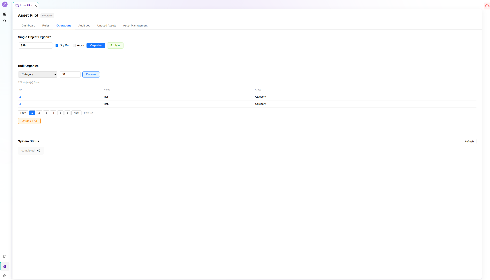

<p align="center">
  <a href="https://oronts.com">
    
  </a>
</p>

<h1 align="center">oronts/asset-pilot-bundle</h1>

<p align="center">
  <strong>Intelligent Rule-Based Asset Organization for Pimcore 12</strong>
</p>

<p align="center">
  <a href="#license"></a>
  <a href="https://www.pimcore.com/"></a>
  <a href="https://www.php.net/"></a>
  <a href="https://symfony.com/"></a>
</p>

<p align="center">
  <a href="#features">Features</a> &bull;
  <a href="#quick-start">Quick Start</a> &bull;
  <a href="#example">Example</a> &bull;
  <a href="#documentation">Documentation</a> &bull;
  <a href="docs/index.md">Full docs</a>
</p>

---

<p align="center">
  
</p>

Asset Pilot automates the organization of Pimcore assets based on configurable rules. When a DataObject is saved, Asset Pilot evaluates its asset fields against a priority-ordered rule set, resolves target paths from Twig templates, and moves files into a structured folder hierarchy. It handles localized fields, supports async processing via Symfony Messenger, logs every operation to an audit trail, and ships with a full Studio UI dashboard.

---

## Features

- **Rule Engine** — Priority-based rule matching with class filtering, field targeting, expression conditions, and asset filters (type, size, extension).
- **Twig Path Templates** — Target paths use full Twig syntax with pre-resolved context variables and custom filters (`safe_key`, `pluck`, `first_of`, `slug`, `fallback`).
- **Expression Language Conditions** — Symfony ExpressionLanguage conditions with 9 built-in functions (`asset_type`, `asset_size`, `is_image`, `has_property`, `path_matches`, and more).
- **Move Strategies** — `always`, `first_assignment`, and `callback` conflict resolution, the last delegating to a custom service.
- **Async Processing** — Moves dispatch to Symfony Messenger with transport-level deduplication via `DeduplicateStamp`; bulk runs in configurable batches.
- **Localized Field Support** — Detects localized asset fields and includes the locale in path resolution for per-language folder structures.
- **Audit Log** — Every move is logged with source/target paths, duration, status, and trigger; supports CSV export, reversal, and per-rule history.
- **Unused Asset Detection** — Finds assets not referenced by any DataObject or Document, filtered by type, extension, date range, folder, and confidence.
- **Confidence Scoring** — Classifies unused assets into five levels (definitely/probably/recently/historically/protected) with color-coded badges.
- **Asset Protection** — Lock individual assets via the `asset_pilot_locked` property, or exclude entire folder trees from organization.
- **Search by Related Object** — Find all assets referenced by a DataObject via the Pimcore dependencies table, or browse assets moved by a rule.
- **Permissions Model** — Three granular levels (`asset_pilot_view`, `asset_pilot_operate`, `asset_pilot_admin`) registered natively in Pimcore.
- **Idempotency & Loop Prevention** — Lock-backed loop guard, stale-job detection, already-at-target skip, and Messenger deduplication keep the pipeline safe under async.
- **Config Validation** — A CLI command validates classes, fields, condition syntax, Twig templates, callback registration, and filter values.
- **Rule Debugger** — Step-by-step evaluation trace per object/asset pair, showing why each rule matched or was skipped.
- **Studio UI Integration** — Full React dashboard in Pimcore Studio via Module Federation: Dashboard, Rules, Operations, Audit Log, Unused Assets, Asset Management.

---

## Quick Start

```bash
composer require oronts/asset-pilot-bundle
```

Enable the bundle in `config/bundles.php`:

```php
return [
    // ...
    Oronts\AssetPilotBundle\OrontsAssetPilotBundle::class => ['all' => true],
];
```

Install the database table and permissions, then build the Studio UI assets:

```bash
bin/console pimcore:bundle:install OrontsAssetPilotBundle

# Build the Studio UI (Module Federation remote; ships as source, not prebuilt)
npm --prefix assets/studio ci
npm --prefix assets/studio run build

bin/console assets:install
bin/console cache:clear
```

Full setup, including Messenger and Lock configuration (both required for async deduplication), is in [docs/installation.md](docs/installation.md).

---

## Example

Define rules under `oronts_asset_pilot`. This organizes product images and localized documents into folders named by item number:

```yaml
oronts_asset_pilot:
    rules:
        product_images:
            class: Product
            fields: [images, galleryImages]
            condition: 'object.getItemNumber() != null'
            target_path: '/Products/{{ object.getItemNumber() }}/Images'
            strategy: always
            priority: 100
            filters:
                types: [image]
                extensions: [jpg, png, webp]

        product_documents:
            class: Product
            fields: [datasheet, manual]
            condition: 'object.getItemNumber() != null'
            target_path: '/Products/{{ object.getItemNumber() }}/Documents{{ locale ? "/" ~ locale : "" }}'
            strategy: always
            priority: 80
```

Preview the moves, then run them:

```bash
# Preview without moving anything
bin/console asset-pilot:organize --class=Product --dry-run

# Organize all Product objects asynchronously
bin/console asset-pilot:organize --class=Product --async --batch-size=100
```

More scenarios (category hierarchies, multi-class setups, move strategies, asset protection, date-based organization) are in [docs/scenarios.md](docs/scenarios.md).

---

## Documentation

Full documentation lives in [docs/](docs/index.md).

- [Installation](docs/installation.md) — require, enable, install the table and permissions, configure Messenger and Lock, build the UI.
- [Configuration](docs/configuration.md) — the full `oronts_asset_pilot` tree, rule reference, and per-rule options.
- [Configuration Scenarios](docs/scenarios.md) — worked recipes for common asset-organization setups.
- [Commands](docs/commands.md) — every `asset-pilot:*` console command, with cron examples.
- [REST API](docs/rest-api.md) — the Studio backend endpoints.
- [Path Templates](docs/path-templates.md) — Twig templates, context variables, custom filters and functions.
- [Conditions](docs/conditions.md) — ExpressionLanguage condition syntax and built-in functions.
- [Permissions](docs/permissions.md) — the three permission levels and what they gate.
- [Studio UI](docs/studio-ui.md) — dashboard tabs, confidence badges, localization.
- [Architecture](docs/architecture.md) — the rule-engine pipeline, idempotency and loop prevention, database schema.
- [Extending](docs/extending.md) — every extension point: filters, strategies, resolvers, evaluators, naming, Twig and ExpressionLanguage hooks, context providers, events.
- [Testing](docs/testing.md) — how to run the suite and how the kernel-free tests are structured.

---

## Requirements

| Dependency | Version |
|------------|---------|
| PHP | >= 8.4 |
| Pimcore | ^12.0 |
| Symfony Expression Language | ^7.0 |
| Symfony Messenger | ^7.3 |
| Symfony Lock | ^7.3 |

---

## License

This project is licensed under the [GNU Affero General Public License v3.0](LICENSE) (AGPL-3.0), the same license used by Pimcore itself.

You are free to use, modify, and distribute this bundle in both private and commercial projects. If you modify the source code and distribute it or run it as a service, you must make your modifications available under the same license.

---

## Consulting & Custom Development

<p align="center">
  <a href="https://oronts.com">
    
  </a>
</p>

**Oronts** provides custom development and integration services:

- Pimcore bundle development and customization
- PIM/DAM implementation and architecture
- Asset workflow automation
- E-commerce platform implementation

**Contact:** office@oronts.com | [oronts.com](https://oronts.com)

---

**Author:** [Oronts](https://oronts.com) - AI-powered automation, e-commerce platforms, cloud infrastructure.

**Contributors:** Refaat Al Ktifan (Refaat@alktifan.com)
