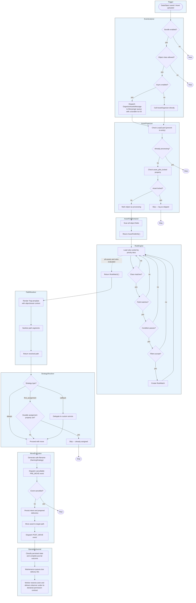

[← Documentation index](index.md) · [Project README](../README.md)

# Architecture



> **Note:** Extracts assets from: image, video, document fields · gallery, hotspotimage fields · relation fields (many-to-one, many-to-many) · localized fields (all locales)

```
src/
├── Action/                 RuleActionInterface + set-property action beyond moving
├── Audit/                  Focused writer, query, export, retention contracts + AuditLogger default
├── Cache/                  Stampede-safe stats caching
├── Command/                CLI: organize, debug-rule, validate-config, status, audit, cleanup-unused, ...
├── Condition/              ConditionEvaluatorInterface + ExpressionLanguage impl
├── Controller/Api/         REST API controllers and OpenAPI metadata
├── DependencyInjection/    Bundle configuration tree + service loading
├── Engine/                 RuleEngine — core matching + explain logic
├── Enum/                   MoveStrategy, OperationStatus, TriggerType, AssetPilotPermission
├── Event/                  AssetMoveEvent + event constants
├── EventListener/          DataObject save + Asset upload listeners
├── Exception/              Typed exceptions (e.g. NotPermittedException)
├── Filter/                 AssetFilterInterface + type/size/extension/composite
├── Health/                 HealthCheckerInterface + tagged HealthCheckInterface probes
├── Integrity/              IntegrityCheckerResolverInterface + tagged image/document/stream checkers
├── Maintenance/            Outbox polling, audit/run retention, quarantine purge, storage snapshots
├── Merge/                  DuplicateMergeStrategyInterface + copy-disposition strategies
├── Message/                Organize, bulk, and exact durable-delivery messages
├── MessageHandler/         Actor-aware organize and durable-delivery handlers
├── Migrations/             Doctrine migrations (schema deltas for existing installs)
├── Model/                  Rule, RuleMatch, RuleEvaluation, MoveOperation, OperationResult
├── Naming/                 NamingStrategyInterface + SafeNamingStrategy
├── Notification/           NotificationDispatcherInterface + typed tagged transports
├── Observer/               Durable operation observers and prepared deliveries
├── PathResolver/           PathResolverInterface + Twig TemplatePathResolver
├── Service/                AssetOrganizer, AssetFieldExtractor, AssetSearchService,
│                           UnusedAssetFinder, QuarantineService, DuplicateMergeService,
│                           ConfidenceScorer, OperationJournal, OperationRecoveryService, LoopGuard
├── Strategy/               ConflictStrategyInterface + built-ins; CallbackDecisionInterface
├── Support/                Relocate-safe shared helpers (e.g. BulkIds)
├── Webpack/                Module Federation entry point provider
├── Zip/                    ZipEntryStrategyInterface + flat/folder/type layout strategies + ZipBuildOptions
├── Installer.php           Database schema + permission registration
└── OrontsAssetPilotBundle.php
```

## Idempotency & Loop Prevention

Asset Pilot uses a multi-layer approach to prevent duplicate processing:

| Layer | Mechanism | TTL | Purpose |
|-------|-----------|-----|---------|
| **Mutation lock** | Symfony Lock | configurable, 60s default | Serializes asset mutation and target allocation; renewed during work |
| **Loop Guard** | shared `cache.app` | bounded marker TTLs | Prevents re-entry when asset moves trigger DataObject saves |
| **Recently Moved** | shared `cache.app` | 300s (5 min) | Prevents async ping-pong for shared assets between objects |
| **Dispatch Dedup** | shared `cache.app` | 10s | Prevents burst duplicate dispatches from rapid saves |
| **Stale Job Detection** | `dispatchedAt` timestamp | — | Skips processing if object was modified after message dispatch |
| **Already-at-Target** | Path comparison | — | Skips move when source path equals target path |
| **Reviewed-plan claim** | database primary key | signed-token TTL | Makes preview/apply tokens single-use across web and workers |
| **Delivery claim** | database token + lease | configurable, 300s default | Makes duplicate polling/messages safe and reclaims abandoned observer work |

> **Requirement:** the loop guard reads `cache.app` and the lock factory reads the configured lock
> store. Both must be a **shared** backend (Redis), not a local/non-shared store (APCu, array, local
> filesystem). With a non-shared store the guarantees do not hold across PHP-FPM and Messenger workers
> or horizontally scaled pods, and duplicate moves can slip through.

Messages carry an immutable actor context. The HTTP path authorizes the source object, source assets,
and target before dispatch; the worker restores and revalidates that authority before mutation. CLI
and automatic listeners use an explicit system actor rather than relying on the absence of a current
user.

`first_assignment` uses the durable `asset_pilot_first_assignment` bool property written with the
asset move. It does not depend on optional or retained audit history. The 2.0 migration backfills the
marker where a historical audit row proves the move committed, including
`completed_with_observer_error`.

Before a move or revert changes Pimcore state, `OperationJournal` writes the exact intent and every
prepared success/failure delivery in one database transaction. After the save attempt, the asset is
force-reloaded and classified from its persisted path and first-assignment marker. A committed target
is never reported as failed because a later log, cache, event, or broker call threw. Unknown or
partial state becomes `recovery_required`; `asset-pilot:recover-operations` can later classify it
under the persisted actor and shared lock without repeating the mutation.

Completing the journal activates only deliveries for the persisted outcome. Pimcore maintenance
polls due IDs, Messenger carries exact IDs, and the database claim remains authoritative under
duplicate messages or broker recovery. Observer execution restores the initiating actor. Observers
that declare an asset permission recheck that ACL and hold the shared asset lock; metadata-only
observers declare no asset permission and do not load or lock the asset. Delivery retries with
bounded backoff. Exhausting a delivery changes an otherwise committed operation to
`completed_with_observer_error`; a failed operation remains failed while dead-delivery health still
reports the observer failure. `asset-pilot:retry-deliveries` can atomically requeue an exact signed
review of dead rows. Their stable IDs, original actor, intent, and payload are retained; the
operation warning clears only after no unresolved delivery remains. Dead and delivered rows keep a
durable audit-reconciliation marker pending until the warning is recorded, cleared, or proven
inapplicable. Pending terminal rows remain maintenance-scheduled with bounded backoff, so a database
outage or process crash between the delivery transition and journal update is repaired without delivering
the observer again.
Only reconciled dead rows are exposed to signed retry planning.

The Composer package ships a versioned Studio remote. Builds compile into a staging generation,
validate the remote and manifests, atomically replace `active.json`, and only then remove obsolete
generations. Source publication retains the previous active generation for rollback. Release packaging runs
`prepare-release-build` to remove inactive generations; the archive verifier rejects a second generation.
`WebpackEntryPointProvider` reads the pointer and exposes exactly one generation.

## Dependency projection

Pimcore 12 schedules its own dependency message before dispatching the element post-add or
post-update event. The default core bus is synchronous, but an application may route that message
asynchronously. Asset Pilot therefore does not infer freshness from the Pimcore dependency table or
its transport. Its pre-save/delete subscriber first persists a revision-fenced dirty source. After
the Pimcore element transaction commits, the post event synchronously calls the element's current
`resolveDependencies()` and atomically replaces the bundle-owned asset edges. A transient failure
leaves the source dirty and dispatches an idempotent repair message; `unknown` blocks destructive
operations until the latest revision is clean.

The bootstrap command scans objects, documents, and assets by ascending ID in a bounded, durable
cursor. A generation becomes `ready` only after every source has been projected and no dirty source
remains. Old-generation rows are removed only during successful completion. The optional live scan
is limited to the initial `bootstrap_required` state; it is never used to hide a failed, partial, or
dirty durable projection.

## Deletion fence

Destructive asset operations (unused-delete, quarantine purge, duplicate disposal) acquire a
token-owned row in `asset_pilot_asset_deletion_fence` after their per-asset `LoopGuard`, re-verify
safety inside the fence, refresh it immediately before `$asset->delete()`, and release it in a
`finally`. The pre-save subscriber rejects, with a Pimcore `ValidationException` (Studio 422), any
element save whose dependencies reference a fenced or missing asset, closing the check-to-delete race.

**Fence scope.** The fence gives a hard guarantee for structured references: relations and element
links carrying `pimcore_id`. A save adding such a reference to an asset under deletion is rejected at
pre-save, and the deleter re-verifies before removing anything. Hard-coded asset paths in text and
WYSIWYG fields are covered best-effort: the deleter re-scans content for the path immediately before
deleting, so a save committing such a path in that final instant can leave a dangling link. Raw paths
carry no integrity guarantee in Pimcore anyway (a rename breaks them without any deletion involved),
so for integrity-critical links use structured relations or editor-inserted element links.

**Consumer transactions.** A consumer may wrap the triggering element save in its own outer database
transaction. Whenever the primary connection is already inside one, the projection publishes its dirty
marker and edges, and the deletion fence performs its pre-save read, on a dedicated autocommit sidecar
connection (`ProjectionMarkerConnection`, behind the non-final `ProjectionMarkerConnectionInterface`
seam), so the marker commits immediately and the fence read observes a concurrently committed tombstone
instead of the consumer's stale `REPEATABLE READ` snapshot. SQLite is exempt: a second handle is a
separate database and a file database has a single writer. Two limitations apply. First, creating an
asset and an element that references it in the same ambient transaction is unsupported, because the
still-uncommitted asset is invisible to the sidecar connection. Second, if a consumer rolls back an
otherwise successful ambient-transaction save, the already-committed dependency edge becomes a phantom,
so a later delete of that asset is conservatively blocked (a safe over-block) until the projection is
reindexed or rebuilt.

## Database Schema

The installer creates fourteen tables (`asset_pilot_apply_plan_claim`, `asset_pilot_audit_log`,
`asset_pilot_quarantine`, `asset_pilot_integrity_log`, `asset_pilot_checksum`,
`asset_pilot_storage_run`, `asset_pilot_storage_snapshot`, `asset_pilot_operation_run`,
`asset_pilot_operation_run_item`, `asset_pilot_operation_delivery`,
`asset_pilot_dependency_source`, `asset_pilot_dependency_edge`,
`asset_pilot_dependency_freshness`, and `asset_pilot_asset_deletion_fence`). The
`asset_pilot_asset_deletion_fence` table holds token-owned tombstones that block a concurrent
asset-referencing save while a hard delete is in flight (a PRE-save fence); a reaper reclaims stale
leases. The apply-plan claim table has a SHA-256 claim ID primary key
and an indexed expiry; its uniqueness is the authority for single-use preview plans. The primary
operational table is the audit log:

```sql
CREATE TABLE asset_pilot_audit_log (
    id          INT AUTO_INCREMENT PRIMARY KEY,
    asset_id    INT          NOT NULL,
    asset_path_from VARCHAR(765) NOT NULL,
    asset_path_to   VARCHAR(765) NOT NULL,
    object_id   INT          NOT NULL,
    object_class VARCHAR(255) NOT NULL,
    rule_name   VARCHAR(255) NOT NULL,
    trigger_type VARCHAR(50) NOT NULL,
    status      VARCHAR(50)  NOT NULL,
    error_message TEXT        NULL,
    durable_observer_failures TEXT NULL,
    duration_ms INT          NULL,
    user_id     INT          NULL,
    created_at  DATETIME     NOT NULL,
    operation_kind VARCHAR(20) NULL,
    actor_type  VARCHAR(20)  NULL,
    parent_audit_id INT      NULL,
    intent_payload TEXT      NULL,
    schema_version INT       NULL,
    updated_at  DATETIME     NULL,
    committed_at DATETIME    NULL,

    INDEX idx_audit_asset_id            (asset_id),
    INDEX idx_audit_object_id           (object_id),
    INDEX idx_audit_rule_name           (rule_name),
    INDEX idx_audit_created_at          (created_at),
    INDEX idx_audit_asset_status        (asset_id, status),
    INDEX idx_audit_rule_status_created (rule_name, status, created_at),
    INDEX idx_audit_status_created      (status, created_at),
    INDEX idx_audit_class_created       (object_class, created_at),
    INDEX idx_audit_recovery            (status, updated_at),
    INDEX idx_audit_parent              (parent_audit_id)
);
```

Every `DATETIME` column across the Asset Pilot tables is persisted in UTC. Writers stamp time with
an explicit UTC clock (`new \DateTimeImmutable('now', new \DateTimeZone('UTC'))`), never ambient
server local time, so stored values stay comparable regardless of the host timezone, and query
cutoffs (retention pruning, the audit and replay `--since` filters) are built in UTC for the same
reason. Owned-table timestamps that cross the REST boundary pass through the `ApiDateFormatter`
serialization seam, which parses them strictly as UTC and emits RFC 3339; Pimcore-native asset
timestamps are rendered as RFC 3339 UTC from their stored Unix time. Internal keyset-pagination
cursors, read-model rows that are reformatted downstream, and the `/health` diagnostic details keep
the raw database value; only the resource wire response is RFC 3339.

`asset_pilot_operation_delivery` stores stable delivery IDs, observer and outcome keys, serialized
intent/payload, status, attempts, retry availability, claim token/lease, errors, delivery time, and
audit-reconciliation time. The unique `(operation_id, observer_id, delivery_key)` index prevents
duplicate prepared work. The `(status, available_at)`, `(status, locked_until)`, and
`(status, audit_reconciled_at)` indexes back bounded maintenance, lease recovery, and terminal audit
repair.

`asset_pilot_operation_run` and `asset_pilot_operation_run_item` persist actor-scoped bulk and
duplicate-merge workflows. Runs retain the current lifecycle status plus processed, succeeded,
skipped, blocked, and failed counts. Each item retains its immutable input fingerprint, current
status, error, state payload, and a claim-token-fenced liveness lease (`claim_token`,
`lease_expires_at`). A worker stamps the token when it claims an item and renews the lease by
heartbeat; maintenance then reconciles a running item whose lease expired
(`reconcileExpiredItemLeases`), a synchronous item abandoned without a lease
(`reconcileAbandonedLeaselessItems`), and a run left non-terminal after all its items finished
(`reconcileUnfinalizedRuns`), so reconciliation fails only items whose durable lease actually expired
and never a legitimately long-running or broker-queued run. Duplicate merges use that payload to persist the reference-repoint
and copy-disposition phase, allowing an interrupted run to resume without repeating a completed
phase. The supported run kinds are `organize`, `reorganize`, `replay`, and `duplicate-merge`;
unknown persisted kinds are not retryable.
