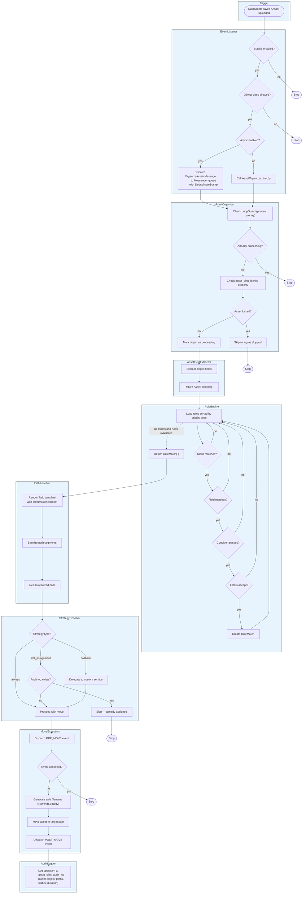

[← Documentation index](index.md) · [Project README](../README.md)

# Architecture



> **Note:** Extracts assets from: image, video, document fields · gallery, hotspotimage fields · relation fields (many-to-one, many-to-many) · localized fields (all locales)

```
src/
├── Action/                 RuleActionInterface + set-property action beyond moving
├── Audit/                  AuditLogger — database-backed operation logging
├── Cache/                  Stampede-safe stats caching
├── Command/                CLI: organize, debug-rule, validate-config, status, audit, cleanup-unused, ...
├── Condition/              ConditionEvaluatorInterface + ExpressionLanguage impl
├── Controller/Api/         REST API controllers (13 controllers, ~48 endpoints)
├── DependencyInjection/    Bundle configuration tree + service loading
├── Dto/                    API request/response DTOs
├── Engine/                 RuleEngine — core matching + explain logic
├── Enum/                   MoveStrategy, OperationStatus, TriggerType, AssetPilotPermission
├── Event/                  AssetMoveEvent + event constants
├── EventListener/          DataObject save + Asset upload listeners (with DeduplicateStamp)
├── Exception/              Typed exceptions (e.g. NotPermittedException)
├── Filter/                 AssetFilterInterface + type/size/extension/composite
├── Health/                 HealthCheckInterface + bundle health checks
├── Integrity/              IntegrityCheckerInterface + image/document/stream checkers
├── Maintenance/            Scheduled maintenance (storage-snapshot capture)
├── Merge/                  DuplicateMergeStrategyInterface + copy-disposition strategies
├── Message/                Messenger messages: OrganizeAssets, BulkOrganize
├── MessageHandler/         Async handlers with stale job detection
├── Migrations/             Doctrine migrations (schema deltas for existing installs)
├── Model/                  Rule, RuleMatch, RuleEvaluation, MoveOperation, OperationResult
├── Naming/                 NamingStrategyInterface + SafeNamingStrategy
├── Notification/           NotifierInterface dispatch
├── PathResolver/           PathResolverInterface + Twig TemplatePathResolver
├── Service/                AssetOrganizer, AssetFieldExtractor, AssetSearchService,
│                           UnusedAssetFinder, QuarantineService, DuplicateMergeService,
│                           ConfidenceScorer, ConfigValidator, LoopGuard
├── Strategy/               ConflictStrategyInterface + Always/FirstAssignment/Callback
├── Support/                Relocate-safe shared helpers (e.g. BulkIds)
├── Webpack/                Module Federation entry point provider
├── Zip/                    ZipEntryStrategyInterface + flat/folder/type layout strategies + ZipBuildOptions
├── Installer.php           Database schema + permission registration
└── OrontsAssetPilotBundle.php
```

## Idempotency & Loop Prevention

Asset Pilot uses a multi-layer approach to prevent duplicate processing:

| Layer | Mechanism | TTL | Purpose |
|-------|-----------|-----|---------|
| **Loop Guard** | Redis cache (`cache.app`) | 60s | Prevents re-entry when asset moves trigger DataObject saves |
| **Recently Moved** | Redis cache | 300s (5 min) | Prevents async ping-pong for shared assets between objects |
| **Dispatch Dedup** | Redis cache | 10s | Prevents burst duplicate dispatches from rapid saves |
| **Stale Job Detection** | `dispatchedAt` timestamp | — | Skips processing if object was modified after message dispatch |
| **Already-at-Target** | Path comparison | — | Skips move when source path equals target path |
| **DeduplicateStamp** | Symfony Lock (Redis) | 30s/60s | Transport-level deduplication prevents the same message from being processed twice |

The `DeduplicateStamp` TTLs:
- **30 seconds** for single-object organize messages (`asset_pilot_organize_{objectId}`)
- **60 seconds** for bulk organize messages (`asset_pilot_bulk_{batchHash}`)

> **Requirement:** the loop guard reads `cache.app` and the lock factory reads the configured lock
> store. Both must be a **shared** backend (Redis), not a local/non-shared store (APCu, array, local
> filesystem). With a non-shared store the guarantees do not hold across PHP-FPM and Messenger workers
> or horizontally scaled pods, and duplicate moves can slip through.

## Database Schema

The installer creates five tables (`asset_pilot_audit_log`, `asset_pilot_quarantine`,
`asset_pilot_integrity_log`, `asset_pilot_checksum`, `asset_pilot_storage_snapshot`). The primary one
is the audit log:

```sql
CREATE TABLE asset_pilot_audit_log (
    id          INT AUTO_INCREMENT PRIMARY KEY,
    asset_id    INT          NOT NULL,
    asset_path_from VARCHAR(500) NOT NULL,
    asset_path_to   VARCHAR(500) NOT NULL,
    object_id   INT          NOT NULL,
    object_class VARCHAR(255) NOT NULL,
    rule_name   VARCHAR(255) NOT NULL,
    trigger_type VARCHAR(50) NOT NULL,
    status      VARCHAR(50)  NOT NULL,
    error_message TEXT        NULL,
    duration_ms INT          NULL,
    user_id     INT          NULL,
    created_at  DATETIME     NOT NULL,

    INDEX idx_audit_asset_id            (asset_id),
    INDEX idx_audit_object_id           (object_id),
    INDEX idx_audit_rule_name           (rule_name),
    INDEX idx_audit_created_at          (created_at),
    INDEX idx_audit_asset_status        (asset_id, status),
    INDEX idx_audit_rule_status_created (rule_name, status, created_at),
    INDEX idx_audit_status_created      (status, created_at),
    INDEX idx_audit_class_created       (object_class, created_at)
);
```
