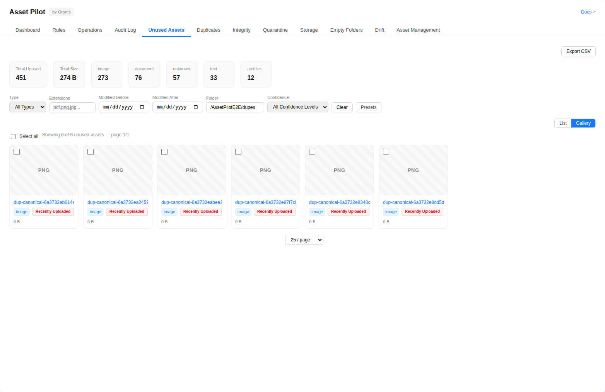
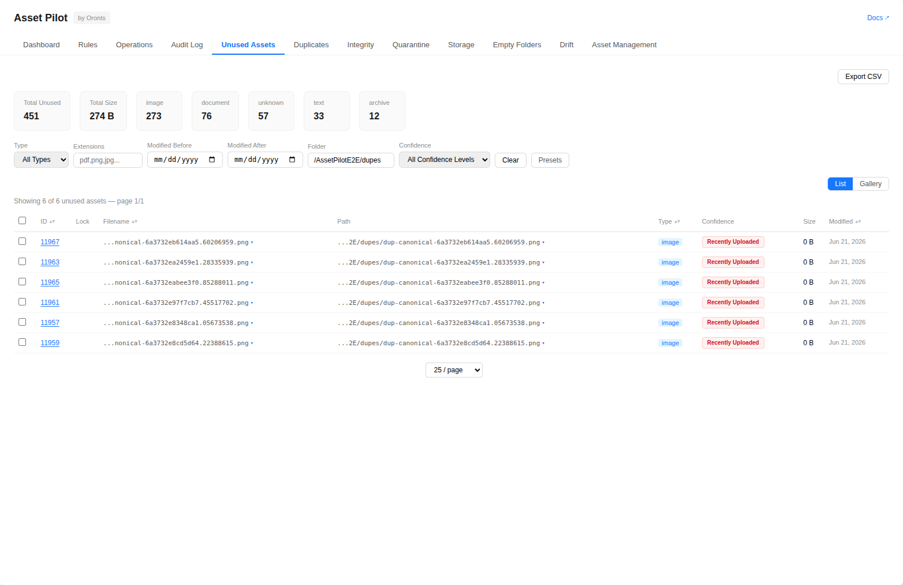
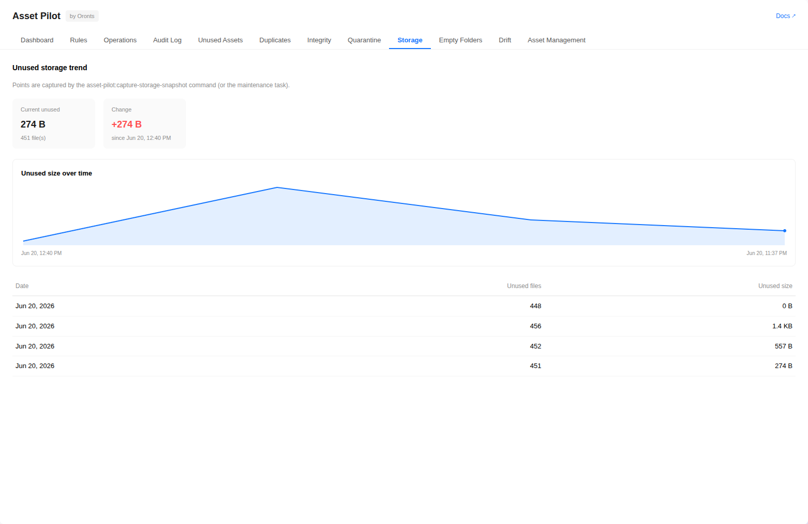
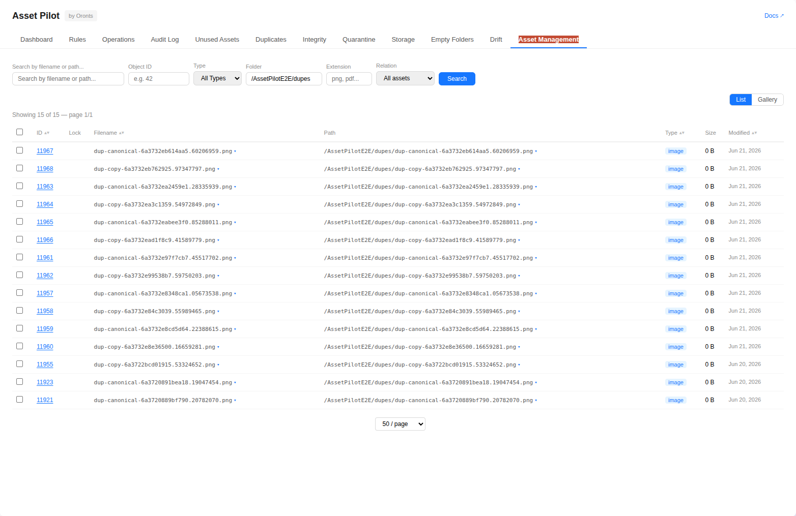
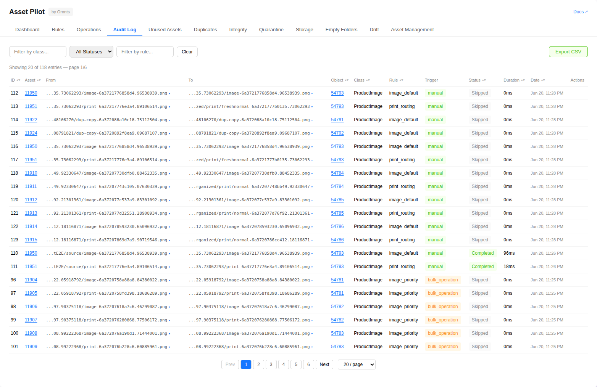

[← Documentation index](index.md) · [Project README](../README.md)

# Studio UI

Asset Pilot integrates into Pimcore Studio as a Module Federation remote, registered under
Experience & E-commerce → Asset Pilot. It has a tab per feature (Dashboard, Rules, Operations, Audit
Log, Unused Assets, Duplicates, Integrity, Quarantine, Storage, Empty Folders, Drift, Asset
Management).



The tabs:

| Tab | Description |
|-----|-------------|
| **Dashboard** | Statistics overview (organized, pending, failed, skipped, and rules counts), an operations-by-status donut and an assets-by-class bar chart, a health panel (database schema, rule config, shared cache, required consumers and queues, dependency tracking, stale/recovery-required journal entries, overdue/dead observer deliveries, and stuck operation runs queued past the backlog threshold), class breakdown table, recent operations list |
| **Rules** | View all configured rules with priority, strategy, target path. Export the rule set as a portable artifact. An overlap panel warns about rules competing for the same assets. Detail modal with configuration and statistics. Preview modal to test a rule against a specific object ID. Compare modal to diff the running rule set against an uploaded exported rule artifact (added, removed, changed, and unchanged rules). |
| **Operations** | Single-object organize, bulk organize with paginated selection, replay, reorganize, durable run status/cancel/retry, and system status. Admins also get signed preview/apply panels for stale journal recovery and exact dead-delivery retry. |
| **Audit Log** | Durable operation history. Sort and filter by class, status, and rule name, export CSV, and revert eligible operations. |
| **Unused Assets** | Confidence-scored unused assets in a list or gallery view with color-coded badges. Filter by type, extensions, date range, folder, and confidence level. User-adjustable page size and CSV export. Bulk delete, move, or quarantine the selected assets; locked rows may be selected but are skipped by those actions (a protected-skipped count is shown), plus bulk lock and bulk unlock the selection. Filter presets. |
| **Duplicates** | Browse indexed byte-identical groups in a list or gallery view, filter by minimum copy count and asset type, export CSV, preview a merge, select the canonical asset and disposition strategy, then confirm the merge. |
| **Integrity** | Scan and inspect currently broken assets in a list or gallery view and preview or apply version rollback healing. Admins get a separate paginated reversible-heal history with lightweight current eligibility and reason; Undo repeats the authoritative content and state checks under lock. |
| **Quarantine** | Review quarantined assets in a list or gallery view, export CSV, and restore an asset to its recorded original path. |
| **Storage** | Plot captured unused-storage trends, including known bytes and unknown-size counts. Snapshot capture itself runs through maintenance or CLI. Visible only to `asset_pilot_admin` users; the tab is hidden and its trend endpoint is not fetched for view/operate users. |
| **Empty Folders** | Review leaf-empty asset folders and delete selected folders after confirmation. |
| **Drift** | Compare current and rule-expected asset paths for a selected class, in a list or gallery view, and show each move's current eligibility. |
| **Asset Management** | Search assets by filename/path; filter by type, folder, Object ID, file extension, or relation (referenced/unreferenced). List or gallery view. Lock/unlock assets. Bulk tag assignment (through paginated server search) and bulk custom-property set are reviewed preview-then-apply operations: a preview reports per-asset eligibility and returns a plan token, a separate apply commits, and a superseded plan is rejected (409) and re-prompted. Collect assets across searches into a capped cart, then ZIP-download, remove items, or clear it from a persistent cart bar. Native streamed ZIP downloads (from the bulk action bar or the cart) with a layout strategy: server default, flat, per-folder, or per-type. Sortable columns with pagination. |

Bounded listings show a "results truncated" status notice when a scan reaches its configured ceiling, and CSV exports append a final truncation marker row when the export budget is reached. Both prompt the user to narrow the filters and reach the remaining rows.

### Screenshots

The Dashboard summarizes operations by status, the class breakdown, recent operations, and a health panel:


The Unused Assets list view, with type/confidence filters, sortable columns, a page-size control, and CSV export:



The Storage tab plots the unused-storage trend from captured snapshots:



The Asset Management tab searches the asset catalog by filename or path, type, folder, Object ID, file extension, or relation (referenced / unreferenced), in a list or gallery view:



The Audit Log shows attempted operations with
their rule, trigger, status, and timestamps. Filter by class, status, or rule, revert an eligible
operation, or export to CSV:



### Confidence Badges

Unused assets display color-coded confidence badges:

| Badge | Color | Meaning |
|-------|-------|---------|
| Definitely Unused | Green | Safe to clean up (>90 days, no references) |
| Probably Unused | Yellow | Review recommended (30-90 days) |
| Recently Uploaded | Red | Wait before action (<30 days) |
| Historically Used | Orange | Was previously organized — investigate |
| Protected | Gray | Locked asset, excluded from cleanup |

The day thresholds shown above are defaults, configurable via `confidence.recently_uploaded_days`
and `confidence.probably_unused_days` (see [Configuration](configuration.md)).

### Localization

The Studio UI ships English and German catalogs for its navigation, labels, and actions under the
`asset-pilot.*` namespace. Rule names, paths, statuses or reasons returned by the server, and other
configuration-derived values are displayed as data and are not translated by those catalogs.

### Permissions

Asset Pilot uses Pimcore's own permission system, not a custom one:

- The three permissions (`asset_pilot_view` / `asset_pilot_operate` / `asset_pilot_admin`) are
  registered as Pimcore `Permission\Definition`s by the installer and appear under Settings →
  Users/Roles (category "Asset Pilot"). Admins are allowed everything automatically.
- **Menu visibility** is gated by the nav item's `permission: 'asset_pilot_view'` — Studio hides the
  module for users without it.
- **Button-level gating** (operate/admin) uses the SDK's `isAllowed()` from `@pimcore/studio-ui-bundle/modules/auth`.
- **Enforcement** is server-side: every REST endpoint carries an Asset Pilot permission attribute.
  Storage trends, integrity history and undo, duplicate merge, journal recovery, dead-delivery retry,
  and tag operations have the additional requirements documented in [REST API](rest-api.md).

The frontend calls the API with the studio session cookie (`credentials: 'same-origin'`) over
`getPrefix()` — no custom token handling.

> The installer verifies all permission definitions and invalidates Studio's permission-key cache.
> Keep `bin/console pimcore:cache:clear` in the deployment sequence after bundle or role changes as a
> safe application-wide transition.

### Building the frontend

Composer releases include the compiled remote under `public/studio/build`; consuming applications do
not run npm. Contributors changing the UI use the pinned Node/npm and Studio SDK versions:

```bash
npm ci --prefix assets/studio
npm --prefix assets/studio test
npm --prefix assets/studio run test:a11y
npm --prefix assets/studio run check-types
npm --prefix assets/studio run lint
npm --prefix assets/studio run notices
npm --prefix assets/studio run build
npm --prefix assets/studio run prepare-release-build # release archives only
npm --prefix assets/studio run verify-build
```

The build is published to a new immutable generation and `active.json` switches only after artifact
validation. Publish bundle assets and clear the Pimcore cache in a consuming application:

```bash
bin/console assets:install
bin/console pimcore:cache:clear
```
